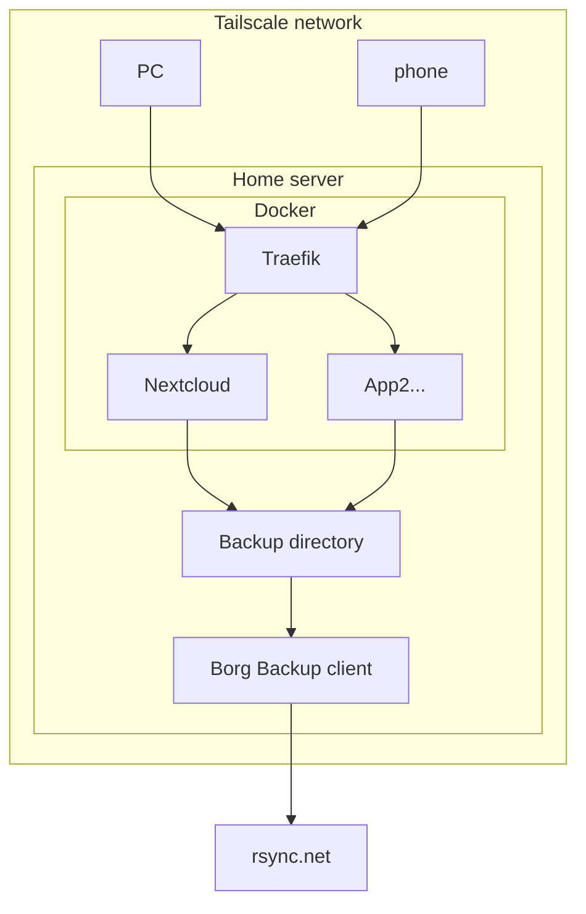

# Quick and easy nextcloud++ on tailscale

## TL;DR

1. Here is what you need to have:

    - tailscale account (free is fine)
    - a domain that uses cloudflare as a nameserver
    - a PC to run docker compose on.

2. Here is what you need to configure:

    - Copy the `env.example` to `.env`, and fill in the enviroment variables.
    - Set up Tailscale client on server and find its tailnet ip. (TODO: make this automatic)
    - Set up a cloudflare root domain to point to the tailscale ip. (TODO: make this automatic)
    - Set up a cloudflare wildcard domain to point to the root domain.

3. Profit

`docker compose up -d`

> **_NOTE:_** First start-up of nextcloud will trigger istallation script, give it a few minutes to complete.
(if you get `bad gateway`, wait a few minutes and try again.)

> **_Info:_** service "stacks" to start are listed in the `docker-compose.yaml` file

## Longer description

## Architecture
All devices communicate over tailscale, and the domain is updated with tailscale IP addresses using cloudflare's API.

